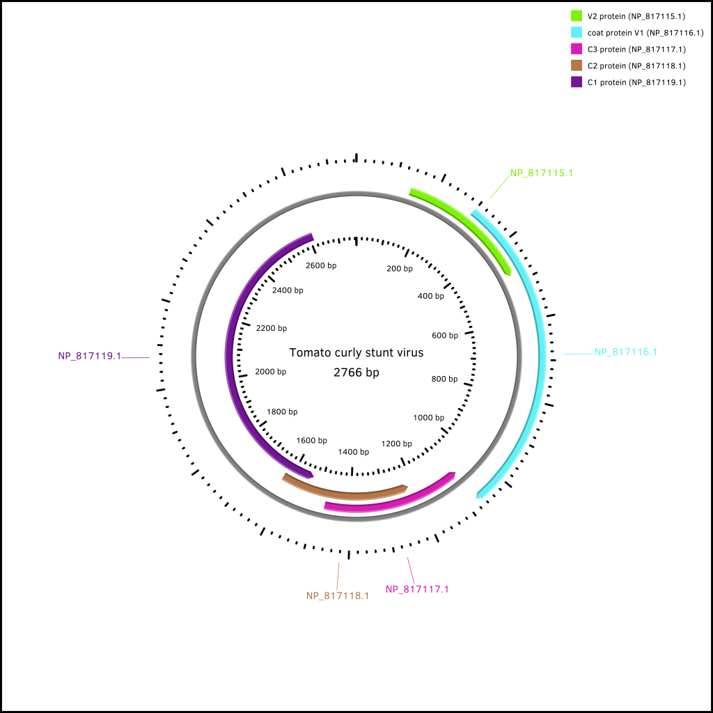

# ACM Research Coding Challenge (Spring 2021)

## No Collaboration Policy

**You may not collaborate with anyone on this challenge.** You _are_ allowed to use Internet documentation. If you _do_ use existing code (either from Github, Stack Overflow, or other sources), **please cite your sources in the README**.

## Submission Procedure

Please follow the below instructions on how to submit your answers.

1. Create a **public** fork of this repo and name it `ACM-Research-Coding-Challenge-S21`. To fork this repo, click the button on the top right and click the "Fork" button.
2. Clone the fork of the repo to your computer using `git clone [the URL of your clone]`. You may need to install Git for this (Google it).
3. Complete the Challenge based on the instructions below.
4. Submit your solution by filling out this [form](https://acmutd.typeform.com/to/uqAJNXUe).

## Question One

Genome analysis is the identification of genomic features such as gene expression or DNA sequences in an individual's genetic makeup. A genbank file (.gb) format contains information about an individual's DNA sequence. The following dataset in `Genome.gb` contains a complete genome sequence of Tomato Curly Stunt Virus. 

**With this file, create a circular genome map and output it as a JPG/PNG/JPEG format.** We're not looking for any complex maps, just be sure to highlight the features and their labels.

**You may use any programming language you feel most comfortable. We recommend Python because it is the easiest to implement. You're allowed to use any library you want to implement this**, just document which ones you used in this README file. Try to complete this as soon as possible.

Regardless if you can or cannot answer the question, provide a short explanation of how you got your solution or how you think it can be solved in your README.md file. However, we highly recommend giving the challenge a try, you just might learn something new!

## Result

### Process

1. Plan the process
	- That's this document!
2. Figure out what a circular genome map is
	- Easy to read way to organize info about a genome
	- Visualizes positions of features in the base pairs
	- Regular and complement features should go on separate layers
	- [Source](https://academic.oup.com/bib/article/20/4/1576/4037458)
3. Figure out what a genbank file stores (**bold** means needed for circular genome map)
	- [Official documentation](https://www.ncbi.nlm.nih.gov/Sitemap/samplerecord.html)
	- **Info about the genome itself**
	- Lots of metadata about research and the database
		- Authors
		- Titles
		- Journals
	- Features of the genome
		- **All feature positions are 1-indexed!**
		- `source`
			- **what the genome is of**
			- **length of genome**
			- db info
			- optionally, more info
		- `gene`
			- **region of interest**
				- **either regular or complement sided**
			- **named**
			- db info
		- `CDS` (coding sequence)
			- **protein id**
			- **region of interest**
				- **either regular or complement sided**
			- amino acid translation
			- db info
	- Sequence data
		- many ATCG entries
4. Figure out how to parse the genbank file
	- Parser combinator in Scala
		- Using `scala-parser-combinators`
		- Super simple way to parse data/text
		- Quick to set up
5. Figure out how to create the image
	- feed parsed genbank data into `CGView`'s API
		- java library
			- can interact with it in Scala since they both run on the JVM
    
### Libraries Used

- [CGView](https://github.com/paulstothard/cgview)
- [scala-parser-combinators](https://github.com/scala/scala-parser-combinators)
